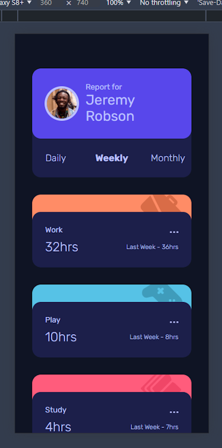
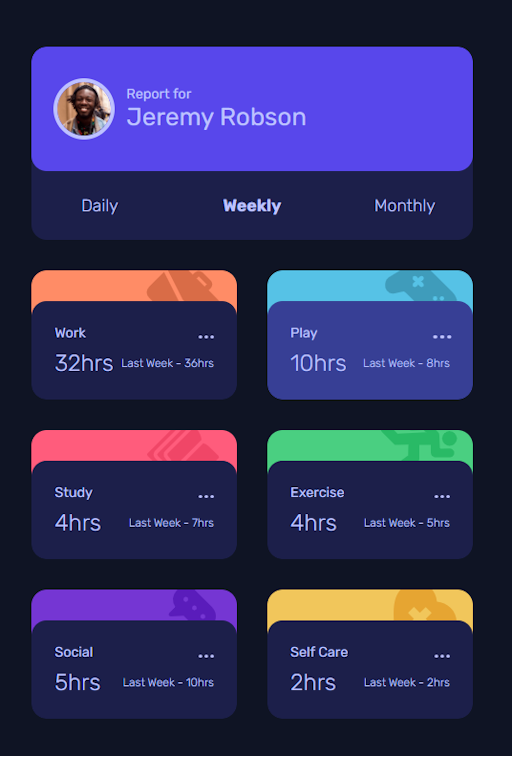
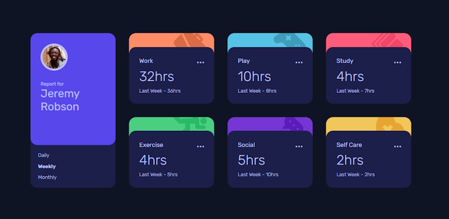

# Time-tracking dashboard

This is my solution to the [Time tracking dashboard challenge on Frontend Mentor](https://www.frontendmentor.io/challenges/time-tracking-dashboard-UIQ7167Jw). 
Frontend Mentor challenges help you improve your coding skills by building realistic projects. 

## Table of contents

- [Overview](#overview)
  - [Screenshot](#screenshot)
  - [Links](#links)
- [My process](#my-process)
  - [Built with](#built-with)
  - [What I learned](#what-i-learned)
  - [AI Collaboration](#ai-collaboration)
- [Author](#author)

## Overview

### Screenshot

#### Movile view



#### Tablet view (portrait)



#### Desktop view



### Links

- Solution URL: https://github.com/FJSolutions/fm-time-tracking-dashboard/
- Live Site URL: https://fbj-fm-tim-tracker.netlify.app/

## My process

### Built with

- Semantic HTML5 markup
- CSS custom properties
- Flexbox
- CSS Grid
- Mobile-first workflow
- [Preact](https://preactjs.com/) - JS library
- [LightningCSS](https://lightningcss.dev/) - For styles
- TypeScript
- [Vite](https://vite.dev/)

### What I learned

I used `preact` as a lighter-weight component framework so that I could test how easy it is in comparison to `react` and found it to be as advertised: very similar. 
I used a component framework so that I didn't have to rewrite the card repeatedly, and to make the code more modular. But I could have used `astro` to do this as it is all server-side code.

I kept the `html` very semantic and resisted the desire to add elements for styling reasons. This meant that I had to think carefully about the card colour and 
image position. My first attempt had some bleed-through that I couldn't get rid of, so I ended up using absolute positioning for the card banners.   

```css
.card {
  position: relative;

  picture {
    position: absolute;
    z-index: -1;
    display: block;
    overflow: hidden;
  }
}
```

Despite the shortness of this section I learned a lot doing this project. Most things I had tried in previous projects and the familiarity of `preact` 
made the tech-stack low risk. The challenges were specific `css` related items, like the above, that challenged me a bit.

I decided to add my own tablet `@media` size in with its own layout an tested that the layouts transitioned smoothly as this was feedback I had received 
previously.

### AI Collaboration

I verified my intuitions and design decisions using browser-based AI. 

## Author

- Frontend Mentor - [Francis Judge](https://www.frontendmentor.io/profile/FJSolutions)
